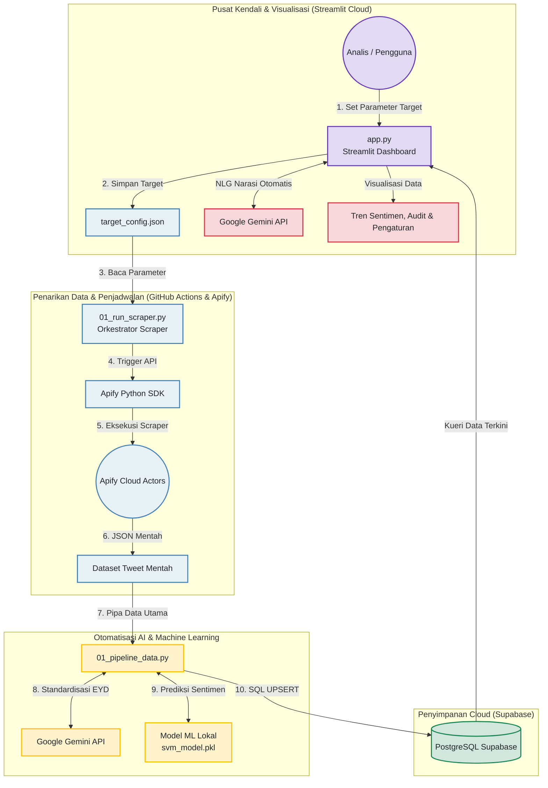

# Walkthrough: Sistem Analisis Sentimen Kebijakan Publik Berbasis AI

Selamat! Seluruh tahapan migrasi dan deployment awan untuk proyek **Analisis Sentimen Kebijakan Publik Berbasis AI** telah berhasil dilaksanakan. Sistem kini telah aktif sepenuhnya secara mandiri (*autonomous*).

Dokumen ini berfungsi sebagai ringkasan arsitektur sistem, berkas utama, serta panduan pengujian penerimaan pengguna (*User Acceptance Testing* - UAT) untuk memverifikasi fungsionalitas akhir sistem Anda.

---

## 🏛️ Arsitektur & Alur Kerja Data

Berikut adalah visualisasi bagaimana data mengalir secara otomatis antara platform digital, database awan Supabase, kecerdasan buatan Gemini, model SVM lokal, dan dasbor interaktif Streamlit Cloud.

---

## 🗂️ Berkas Utama Proyek

*   **Antarmuka Visual**: [app.py](file:///d:/GitHub/socmed-sentimen-analysis-pp/app.py) & [nlg_generator.py](file:///d:/GitHub/socmed-sentimen-analysis-pp/nlg_generator.py)
*   **Logika Database**: [db_manager.py](file:///d:/GitHub/socmed-sentimen-analysis-pp/db_manager.py)
*   **Orkestrator Scraper**: [01_run_scraper.py](file:///d:/GitHub/socmed-sentimen-analysis-pp/01_run_scraper.py) & [config_parser.py](file:///d:/GitHub/socmed-sentimen-analysis-pp/config_parser.py)
*   **Pipa AI & Klasifikasi**: [01_pipeline_data.py](file:///d:/GitHub/socmed-sentimen-analysis-pp/01_pipeline_data.py) & [models/svm_model.pkl](file:///d:/GitHub/socmed-sentimen-analysis-pp/models/svm_model.pkl)
*   **Alur Kerja Awan**: [.github/workflows/daily_pipeline.yml](file:///d:/GitHub/socmed-sentimen-analysis-pp/.github/workflows/daily_pipeline.yml)

---

## 🛠️ Langkah Pengujian Akhir (User Acceptance Testing - UAT)

Guna memastikan seluruh sistem terhubung tanpa hambatan, silakan lakukan tiga langkah pengujian berikut:

### Langkah 1: Pengujian Antarmuka Streamlit Cloud
1.  Buka URL aplikasi Streamlit Cloud Anda yang sudah dideploy.
2.  Pergi ke tab **⚙️ Pengaturan Target** di paling kiri.
3.  Ubah kata kunci pencarian (misal tambahkan kata kunci kebijakan baru yang sedang tren) lalu klik **Simpan Konfigurasi Target**.
4.  Pastikan parameter berhasil tersimpan ke berkas konfigurasi.

### Langkah 2: Pengujian Pemicu Manual GitHub Actions
1.  Buka repositori GitHub proyek Anda di browser.
2.  Masuk ke tab **Actions** di menu atas.
3.  Pilih workflow **"Daily Data Scraping & AI Sentiment Pipeline"** di sebelah kiri.
4.  Klik tombol dropdown **Run workflow** -> pilih cabang `main` -> klik tombol hijau **Run workflow**.
5.  Tunggu sekitar 1–2 menit hingga seluruh indikator berwarna hijau (sukses).
6.  Klik pada riwayat eksekusi tersebut untuk melihat log detail dari modul penarikan data Apify dan standardisasi AI/ML.

### Langkah 3: Verifikasi Sinkronisasi Data
1.  Kembali ke dasbor Streamlit Cloud Anda.
2.  Masuk ke tab **📊 Analitik Sentimen** lalu klik tombol **🔄 Perbarui Analisis Narasi**.
3.  Pastikan ringkasan eksekutif berbasis bahasa alami (NLG) berhasil dirender oleh Gemini API dengan mengambil data kueri terbaru.
4.  Masuk ke tab **📑 Jejak Audit Data** untuk memverifikasi baris tweet baru telah tersimpan berdampingan antara *Teks Mentah* dari media sosial dengan *Teks Baku (EYD)* hasil olahan AI.
5.  *Optional*: Klik tombol **🌐 Buka Tabel Supabase** di sidebar dasbor untuk memastikan baris baru berhasil ditulis ke server PostgreSQL secara langsung.

---

> [!NOTE]
> Sistem saat ini dikonfigurasi dalam mode otomatis harian. Jika Anda ingin menonaktifkan cronjob otomatis GitHub Actions agar tidak memakan sisa batas gratis API Apify/Gemini secara berkala, Anda dapat mengubah **Mode Penarikan Data (Scraping)** di sidebar dasbor menjadi **Manual (Hanya via Dasbor)**.
