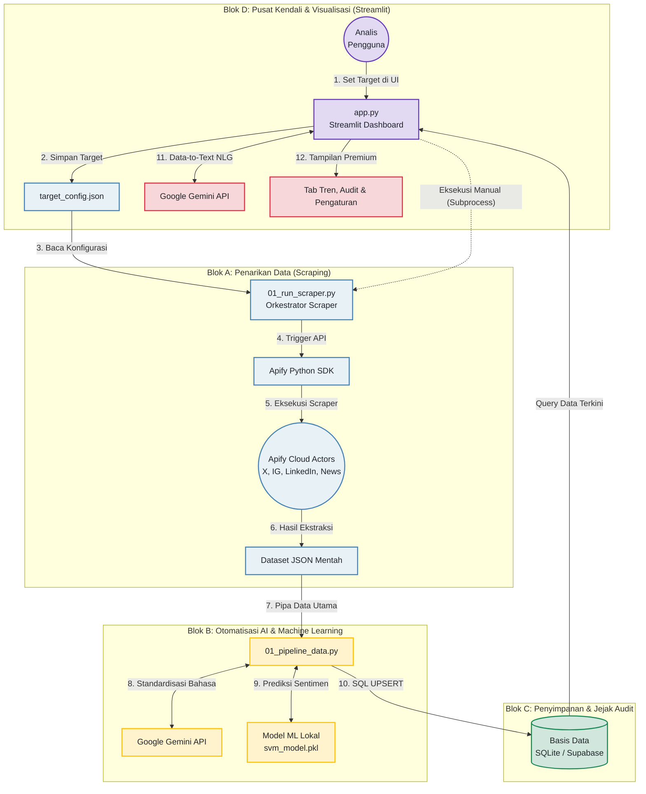

# Diagram Alur Kerja & Peta Jalan Pembuatan Sistem
**Proyek:** Analisis Sentimen Kebijakan Publik Berbasis Kecerdasan Bahtan (AI)

Dokumen ini menyediakan diagram visual menggunakan sintaksis **Mermaid** untuk memudahkan Anda mempresentasikan cara kerja sistem dan proses pembuatannya kepada publik atau pemangku kebijakan. Anda dapat langsung menyalin kode Mermaid di bawah ini ke dalam slide presentasi (seperti Notion, GitHub, Canva, atau PowerPoint yang mendukung Mermaid).

---

## 1. Diagram Alur Kerja Pipa Data (*Data Pipeline*)
Diagram ini menjelaskan bagaimana data mengalir dari platform media sosial hingga disajikan secara interaktif dalam bentuk narasi laporan analitik di dasbor Streamlit.

### Penjelasan Langkah Alur Data untuk Presentasi:
1. **Fase Kendali & Visualisasi (Streamlit):** Pengguna berinteraksi dengan dasbor Streamlit untuk menentukan parameter target (seperti media sasaran, kata kunci, dll.). Pengaturan ini disimpan langsung ke dalam `target_config.json`. Pengguna juga bisa memicu penarikan data secara instan dari antarmuka ini.
2. **Fase Ingestion Multi-Sumber:** Orkestrator membaca konfigurasi dan mengirimkan instruksi ke *Actor* di Apify (mencakup Twitter, Instagram, LinkedIn, atau Portal Berita). Apify menarik data mentah secara aman tanpa terblokir, lalu mengembalikannya dalam format JSON.
3. **Fase Pemrosesan AI & ML:** Data mentah kemudian dibersihkan (standardisasi bahasa gaul ke EYD) menggunakan kecerdasan buatan Gemini, lalu diklasifikasikan sentimennya secara instan oleh model *Machine Learning* lokal (SVM).
4. **Fase Penyimpanan:** Hasil analisis (baik mentah maupun bersih) direkam berdampingan ke dalam basis data terpusat dengan mekanisme *Upsert* untuk menjamin jejak audit (*audit trail*) transparan tanpa adanya duplikasi data.
5. **Kembali ke Visualisasi:** Dasbor Streamlit mengambil data terbaru, mendayagunakan Gemini API sekali lagi untuk menulis narasi laporan eksekutif otomatis (NLG), dan menyuguhkan semuanya ke pengguna lewat grafik taktis yang siap digunakan untuk mengambil keputusan.

---

## 2. Diagram Peta Jalan Pembuatan (*Walkthrough Alur Pembuatan*)
Diagram ini menyajikan lini masa pengembangan sistem yang dibagi menjadi dua fase strategis: dari pembuktian konsep lokal (MVP) hingga peluncuran otomatisasi penuh di awan (Production).

```mermaid
graph LR
    %% Styling Global
    classDef Lokal fill:#E2E2E2,stroke:#666666,stroke-width:2px,color:#333333;
    classDef Cloud fill:#CCE5FF,stroke:#004085,stroke-width:2px,color:#004085;
    classDef Sukses fill:#D4EDDA,stroke:#155724,stroke-width:2px,color:#155724;

    %% FASE 1: LOKAL MVP
    subgraph Fase_1 ["FASE 1: LOKAL MVP (Pembuktian Konsep)"]
        L1[1. Setup Env & Repositori] --> L2[2. Inisialisasi Database SQLite]
        L2 --> L3[3. Pipa Data Scraping & AI]
        L3 --> L4[4. Pelatihan Model SVM]
        L4 --> L5[5. Integrasi Dashboard Streamlit]
    end
    class L1,L2,L3,L4,L5 Lokal;

    %% JALUR MIGRASI
    L5 -->|Uji Coba Lokal Sukses| M1{Migrasi Sistem}

    %% FASE 2: CLOUD PRODUCTION
    subgraph Fase_2 ["FASE 2: CLOUD PRODUCTION (Otomatisasi Publik)"]
        C1[1. Migrasi DB ke Supabase PostgreSQL] --> C2[2. Unggah Repositori ke GitHub]
        C2 --> C3[3. Konfigurasi GitHub Actions Scheduler]
        C3 --> C4[4. Deploy Dashboard ke Streamlit Cloud]
        C4 --> C5[5. Evaluasi & Serah Terima UAT]
    end
    class C1,C2,C3,C4,C5 Cloud;

    M1 -->|Awan / Cloud| C1
    C5 --> S1((SISTEM AKTIF DAN AUTONOMOUS))
    class S1 Sukses;
```

### Narasi Walkthrough Pembuatan untuk Presentasi:
* **Fase 1 (Lokal MVP):** Kami membangun fondasi sistem di komputer lokal terlebih dahulu untuk meminimalkan biaya riset. Di sini, kami melatih model Machine Learning kami menggunakan dataset kecil, menyusun database relasional yang ringan (SQLite), dan memastikan dasbor Streamlit mampu memvisualisasikan data lokal dengan lancar.
* **Fase 2 (Cloud Production):** Setelah fungsionalitas sistem terbukti sempurna secara lokal, kami melakukan migrasi skala penuh ke ekosistem awan. Kami memindahkan penyimpanan data ke server Supabase PostgreSQL agar aman, mengonfigurasi jadwal penarikan data harian otomatis tanpa pelayan (*serverless*) lewat GitHub Actions, dan mempublikasikan dasbor Streamlit ke internet secara gratis menggunakan Streamlit Community Cloud agar dapat diakses kapan saja oleh pemangku kepentingan.
