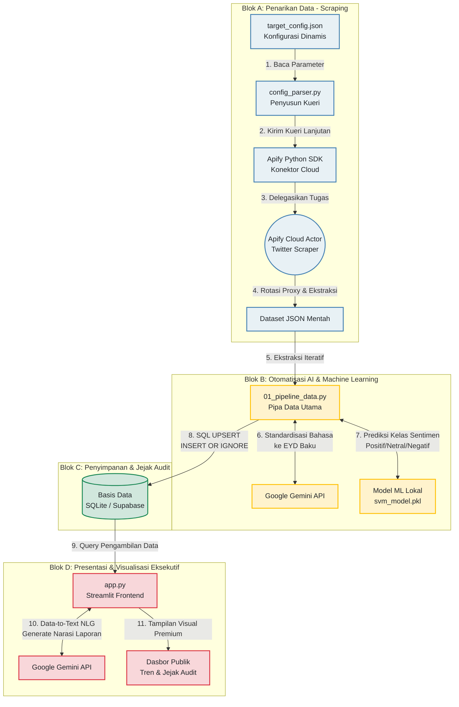

# Diagram Alur Kerja & Peta Jalan Pembuatan Sistem
**Proyek:** Analisis Sentimen Kebijakan Publik Berbasis Kecerdasan Bahtan (AI)

Dokumen ini menyediakan diagram visual menggunakan sintaksis **Mermaid** untuk memudahkan Anda mempresentasikan cara kerja sistem dan proses pembuatannya kepada publik atau pemangku kebijakan. Anda dapat langsung menyalin kode Mermaid di bawah ini ke dalam slide presentasi (seperti Notion, GitHub, Canva, atau PowerPoint yang mendukung Mermaid).

---

## 1. Diagram Alur Kerja Pipa Data (*Data Pipeline*)
Diagram ini menjelaskan bagaimana data mengalir dari platform media sosial hingga disajikan secara interaktif dalam bentuk narasi laporan analitik di dasbor Streamlit.

### Penjelasan Langkah Alur Data untuk Presentasi:
1. **Fase Ingestion:** Pengguna menentukan topik kebijakan yang ingin dianalisis di berkas konfigurasi lokal. Sistem secara otomatis menyusun kueri pencarian Twitter yang rumit dan mengirimkannya ke platform awan Apify untuk melakukan penarikan data secara aman tanpa terkena blokir IP.
2. **Fase Pemrosesan AI & ML:** Data mentah hasil ekstraksi dibersihkan bahasanya dari bahasa gaul/singkatan menjadi bahasa Indonesia baku (EYD) menggunakan kecerdasan buatan Gemini, lalu langsung diklasifikasikan sentimennya menggunakan model *Machine Learning* SVM (*Support Vector Machine*) yang telah dilatih secara khusus.
3. **Fase Penyimpanan:** Hasil analisis disimpan ke dalam basis data terpusat menggunakan mekanisme *Upsert* untuk menjamin data mentah asli dan data hasil pembersihan tersimpan berdampingan sebagai jejak audit yang transparan dan bebas duplikasi.
4. **Fase Visualisasi:** Dasbor Streamlit menarik data secara cepat dari database, mengirimkan statistik ringkas ke Gemini untuk dibuatkan narasi laporan birokrasi otomatis (NLG), dan menyajikannya dalam grafik tren interaktif kepada pemangku kebijakan.

---

## 2. Diagram Peta Jalan Pembuatan (*Walkthrough Alur Pembuatan*)
Diagram ini menyajikan lini masa pengembangan sistem yang dibagi menjadi dua fase strategis: dari pembuktian konsep lokal (MVP) hingga peluncuran otomatisasi penuh di awan (Production).

```mermaid
graph LR
    %% Styling Global
    classDef Lokal fill:#E2E2E2,stroke:#666666,stroke-width:2px,color:#333333;
    classDef Cloud fill:#CCE5FF,stroke:#004085,stroke-width:2px,color:#004085;
    classDef Sukses fill:#D4EDDA,stroke:#155724,stroke-width:2px,color:#155724;

    %% FASE 1: LOKAL MVP
    subgraph Fase_1 ["FASE 1: LOKAL MVP (Pembuktian Konsep)"]
        L1[1. Setup Env & Repositori] --> L2[2. Inisialisasi Database SQLite]
        L2 --> L3[3. Pipa Data Scraping & AI]
        L3 --> L4[4. Pelatihan Model SVM]
        L4 --> L5[5. Integrasi Dashboard Streamlit]
    end
    class L1,L2,L3,L4,L5 Lokal;

    %% JALUR MIGRASI
    L5 -->|Uji Coba Lokal Sukses| M1{Migrasi Sistem}

    %% FASE 2: CLOUD PRODUCTION
    subgraph Fase_2 ["FASE 2: CLOUD PRODUCTION (Otomatisasi Publik)"]
        C1[1. Migrasi DB ke Supabase PostgreSQL] --> C2[2. Unggah Repositori ke GitHub]
        C2 --> C3[3. Konfigurasi GitHub Actions Scheduler]
        C3 --> C4[4. Deploy Dashboard ke Streamlit Cloud]
        C4 --> C5[5. Evaluasi & Serah Terima UAT]
    end
    class C1,C2,C3,C4,C5 Cloud;

    M1 -->|Awan / Cloud| C1
    C5 --> S1((SISTEM AKTIF DAN AUTONOMOUS))
    class S1 Sukses;
```

### Narasi Walkthrough Pembuatan untuk Presentasi:
* **Fase 1 (Lokal MVP):** Kami membangun fondasi sistem di komputer lokal terlebih dahulu untuk meminimalkan biaya riset. Di sini, kami melatih model Machine Learning kami menggunakan dataset kecil, menyusun database relasional yang ringan (SQLite), dan memastikan dasbor Streamlit mampu memvisualisasikan data lokal dengan lancar.
* **Fase 2 (Cloud Production):** Setelah fungsionalitas sistem terbukti sempurna secara lokal, kami melakukan migrasi skala penuh ke ekosistem awan. Kami memindahkan penyimpanan data ke server Supabase PostgreSQL agar aman, mengonfigurasi jadwal penarikan data harian otomatis tanpa pelayan (*serverless*) lewat GitHub Actions, dan mempublikasikan dasbor Streamlit ke internet secara gratis menggunakan Streamlit Community Cloud agar dapat diakses kapan saja oleh pemangku kepentingan.
